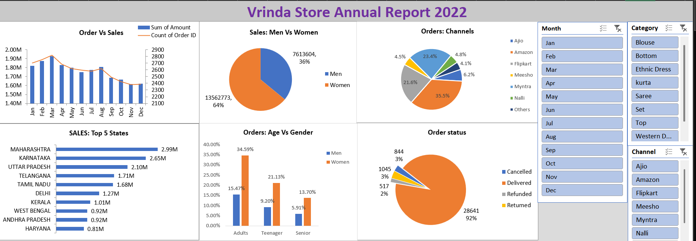

# Vrinda-Store-Interactive-Ms-Excel-Dashboard
The project is a Ms Excel dashboard designed to create an annual sales report for 2022, providing real-time progress and sales insights for the employees and owner of Vrinda Store. 

## Tools Used
- Microsoft Excel
- Pivot Tables
- Pivot Charts
- Dashboard Design

## Objectives
- Create an annual sales report for 2022
- Enable employees to understand customers' behavior
- Facilitate informed strategies for driving sales growth
  
## Questions Addressed
1. Comparison of sales and orders using a single chart
2. Identification of the month with the highest sales and orders
3. Demographic breakdown of purchases by gender
4. Listing of different order statuses in 2022
5. Identification of the top 10 states contributing to sales
6. Analysis of the relationship between age, gender, and sales
7. Determination of the channel contributing to maximum sales
8. Identification of the highest selling category

## Key Insights
- Women contributed the majority of sales(64%).
- Adult age group generated the highest revenue(50%).
- Amazon, Flipkart and Myntra were the top-performing sales channels(80%).
- Maharashtra generated the highest sales among all states.

## Final Conclusion and Recommendations
Target women customers aged 30-49 residing in Maharashtra, Karnataka, and Uttar Pradesh by utilizing ads, offers, and coupons available on Amazon, Flipkart, and Myntra. This strategy aims to improve sales at Vrinda Store.

## Files Included
-Vrinda Store Data Analysis.xlsx

## Dashboard Preview
[Download the Excel Dashboard](Vrinda%20Store%20Data%20Analysis.xlsx)

## Dashboard Preview

